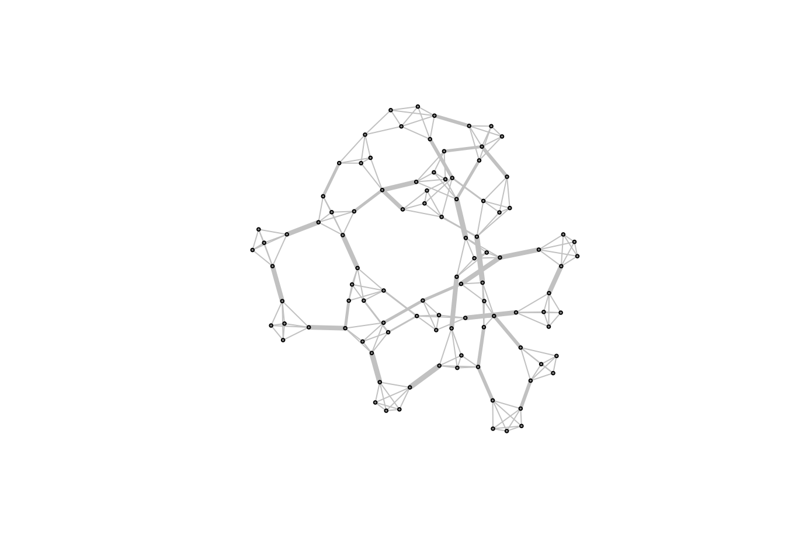

# Bridges, Holes, the Small World Problem, and Simulation

**Learning objectives:**

-   Simulation of different network architectures.
-   Identifying bridging ties and articulation points.

## It's a small world after all

-   Real-world social networks tend to be "small worlds".

-   In a small world architecture nodes belong to well defined clusters that are connected to one another.

    -   Pairs exhibit few long paths and many short paths facilitated by hubs.

    -   Highly clustered though proximal on average.

-   "Six degrees of separation" <https://www.sixdegreesofwikipedia.com/>

-   An extreme network structure is "caveman structure" of very tight and small clusters loosely connected to one another.

    {alt="A cave man structure of 100 people and 20 communites" width="441"}

    -   Low density (connected edges out of all possible edges)

    -   High transitivity (clustering tendency)

    -   High path length AKA degrees of separation (\>10) (average number of edges connecting two random nodes)

    -   Large diameter (shortest path between two furthest nodes/ number of edges separate any two nodes on average).

{width="448"}

How can one decrease the average path length of the caveman network? In other words, how to obtain a "small world" starting from a "cave man"? Bring it closer to a "random network"!

Randomly rewiring the network while maintaining the average node degree results is edges that cut through the network!\
{width="458"}

The more random rewiring the more similar it gets to a random network.

{width="485"}

{width="487"}

How does small world networks compare to other structures?

{width="553"}

{width="553"}

## Measuring connectivity of networks

-   Br(i/e)dge: The only tie that connects two otherwise distinct components in a network.\
    [{width="435"}](https://www.google.com/url?sa=i&url=https%3A%2F%2Fcodeforces.com%2Fblog%2Fentry%2F71146&psig=AOvVaw10MZxmI4G5IzLPdIssxHYQ&ust=1676302352409000&source=images&cd=vfe&ved=0CBEQjhxqFwoTCKCpsYSnkP0CFQAAAAAdAAAAABB5)

-   Local br(i/e)dge: The tie that greatly reduces the distance -tie range- between two modules.\
    

In a network were connections are redundant there is an absence of bridges.
This is the case for small world networks! Nevertheless, on can still explore local bridges.

{width="498"}

-   vertex connectivity: The vertex connectivity of a graph is the minimum vertex connectivity of all pairs of vertices in the graph/ the lowest number of vertices in a connected graph whose removal disconnects the graph (articulation points).\
    

-   Burt's Constraint: It is **commonly used as a measure of structural holes** (accurately speaking, the lack of it, because the larger the constraint value, the less structural opportunities a node have for bridging structural holes.)

    -   Negatively correlated to betweeness.
        

        

## One last thing

-   igraph provides many simulation functions for different network architectures.

{width="483"}

## Meeting Videos

### Cohort 1

`r knitr::include_url("https://www.youtube.com/embed/URL")`

Meeting chat log

    LOG

